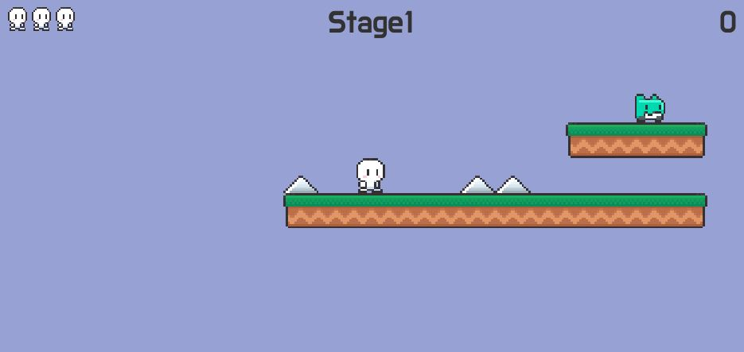
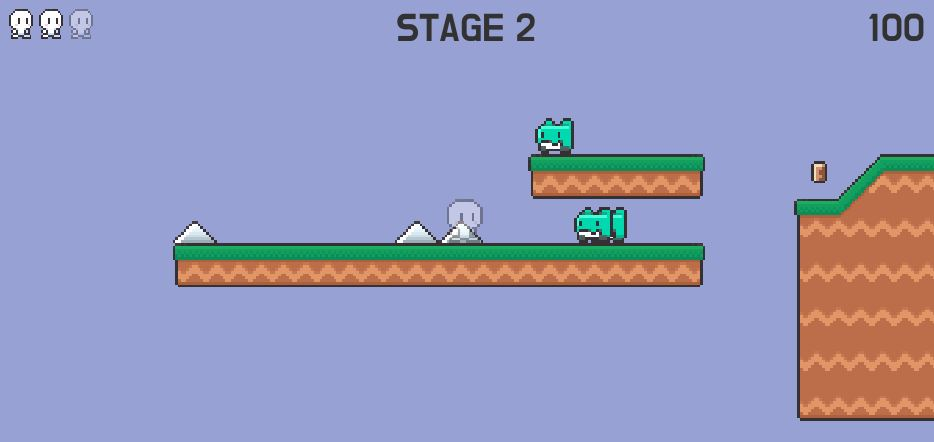

## *참고
<a href='https://www.youtube.com/watch?v=v_Y5FH_tCpc&list=PLO-mt5Iu5TeZGR_y6mHmTWyo0RyGgO0N_'>2D 플랫포머 - 프로젝트 준비하기 [유니티 기초 강좌 B13 + 에셋 다운로드]</a>

Unity로 2D 플랫포머 게임입니다. 게임을 만들었습니다. 이번에는 BOLT를 사용하지 않았으며 C# Scripting으로만 구현했습니다.  

일반적인 2D 플랫포머 게임입니다.
사용된 객체는 플레이어, 몬스터, 아이템, 플랫폼이며 각 객체의 이동, 충돌 등을 구현했습니다. 또 게임매니저, 사운드매니저라는 게임 객체를 통해 각종 게임의 효과를 구현했습니다.  
이번에는 BOLT를 사용하지 않았기 때문에 C#스크립트가 그대로 구현되어 있는데 다음에 사용할 때 쉽게 참고할 수 있겠습니다.

## Preview

